# Lab-05-Robotica-2025-2
Laboratorio 5 de Robótica 2025-2s, realizado por Jeison Diaz y Mateo Ramos

# Integrantes
1. Jeison Nicolás Diaz Arciniegas [jediazar@unal.co](JeisonD0819)
2. Mateo Ramos Cujer [mramoscu@unal.edu.co](MateoKGR)

# Informe

Indice:
1. [Descripción detallada de la solución planteada](#descripcion)
2. [Diagramas digitales y DH utilizado](#diagramas)
3. [Gráficas digitales comparativas](#graf_dig)
4. [Diagrama de flujo de acciones del robot](#diagrama_flujo)
5. [Videos](#videos)
6. [Plano de planta](#plano_planta)
7. [Código explicado](#codigo)


## Descripción detallada de la solución planteada
Se desarrolló un nodo de ROS 2 en Python que permite:

Comunicación directa con los motores Dynamixel mediante puerto serial.
Control individual y conjunto de cada articulación del manipulador.
Publicación del mensaje `/joint_states` para animación del modelo en RViz.
Implementación de una interfaz gráfica con control articular, control numérico, visualización en RViz y cálculo de la posición del TCP mediante cinemática directa.

La arquitectura del sistema integra tres componentes principales:
1. Nodo ROS 2 de control de motores.
2. Interfaz gráfica (GUI) en Tkinter.
3. Modelo del robot visualizado en RViz.

*Funciones utilizadas*
Control articular por sliders: Permite mover cada articulación del robot en tiempo real mediante deslizadores, respetando los límites físicos de los motores.
Control articular por ingreso numérico: Permite ingresar directamente valores de posición para cada motor.
Visualización en RViz: Se sincroniza el robot físico con el modelo virtual del PhantomX Pincher X100 usando `robot_state_publisher`.
Cinemática directa (TCP): Se calcula la posición del TCP utilizando parámetros DH y se muestran las coordenadas X, Y y Z en tiempo real.
Rutinas predefinidas: Se implementaron rutinas de movimiento que reproducen las poses solicitadas en el laboratorio.

## Diagramas digitales y DH utilizado
La cinemática directa se implementó usando parámetros Denavit-Hartenberg medidos directamente del robot:

| i | θᵢ | dᵢ | aᵢ | αᵢ |
|---|----|----|----|----|
| 1 | q1 | L1 | 0  | -π/2 |
| 2 | q2 | 0  | L2 | 0 |
| 3 | q3 | 0  | L3 | 0 |
| 4 | q4 | 0  | 0  | π/2 |

A continuación los diagramas utilizados.


Visualización completa en MATLAB

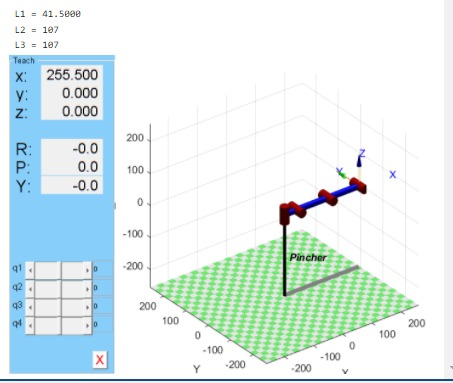
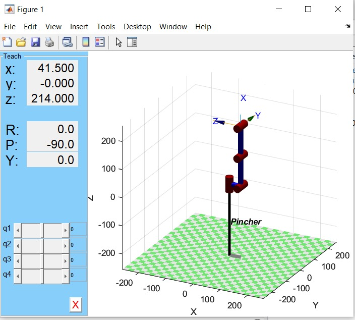

## Graficas digitales comparativas
A continuación los diagramas digitales de las diferentes poses.


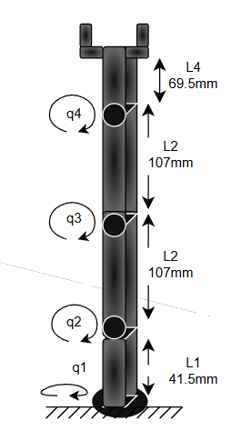
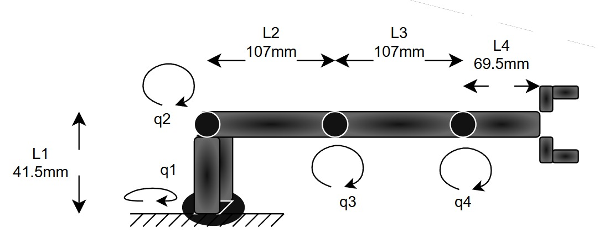
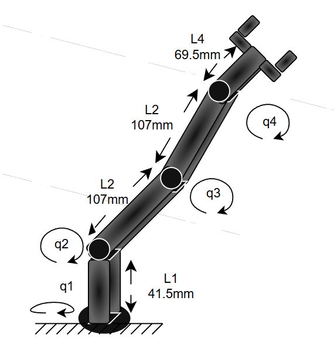
Estas dos poses son equivalentes, solamente cambia q1.

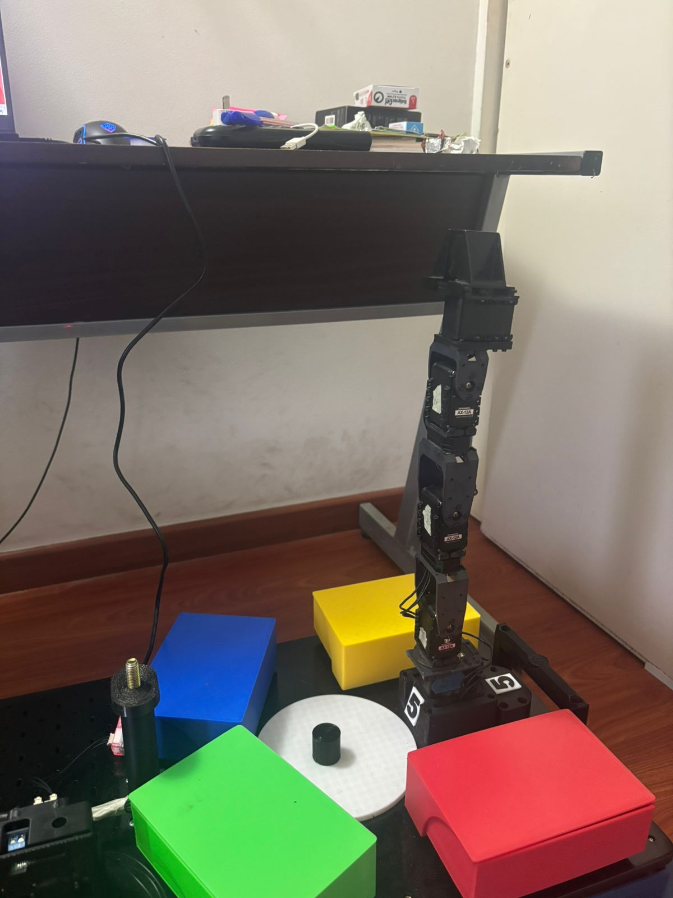
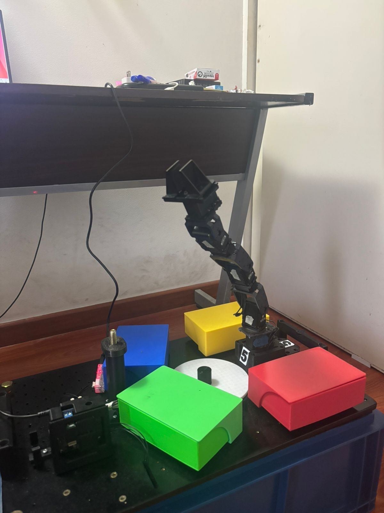
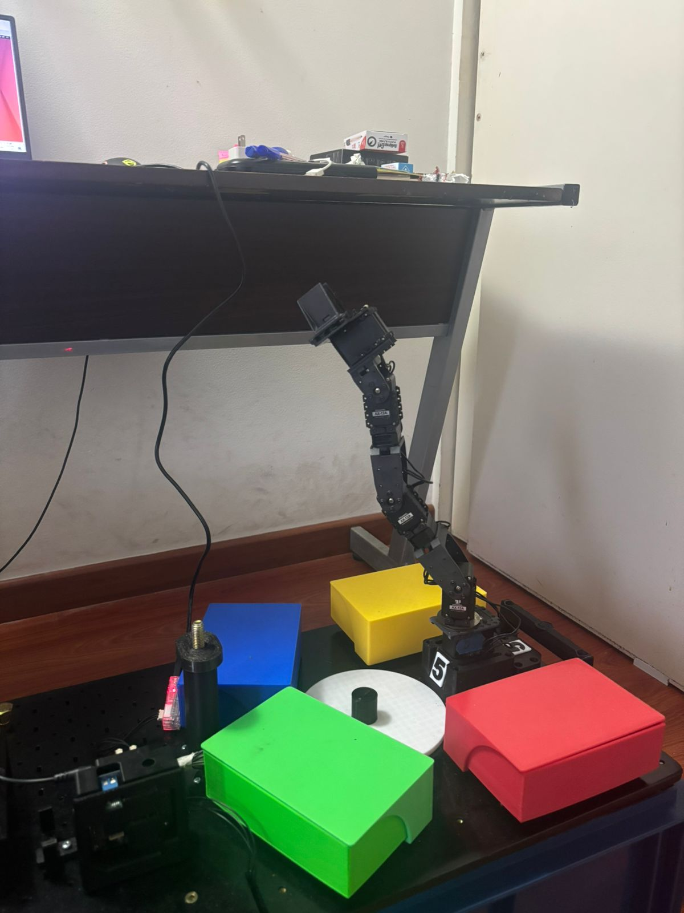
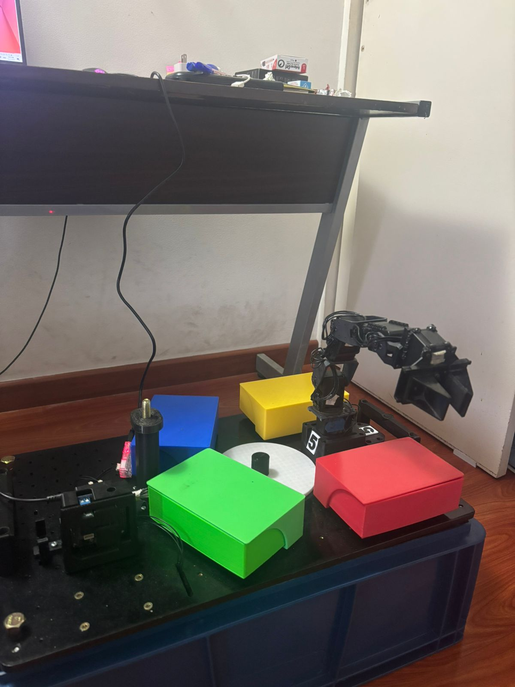
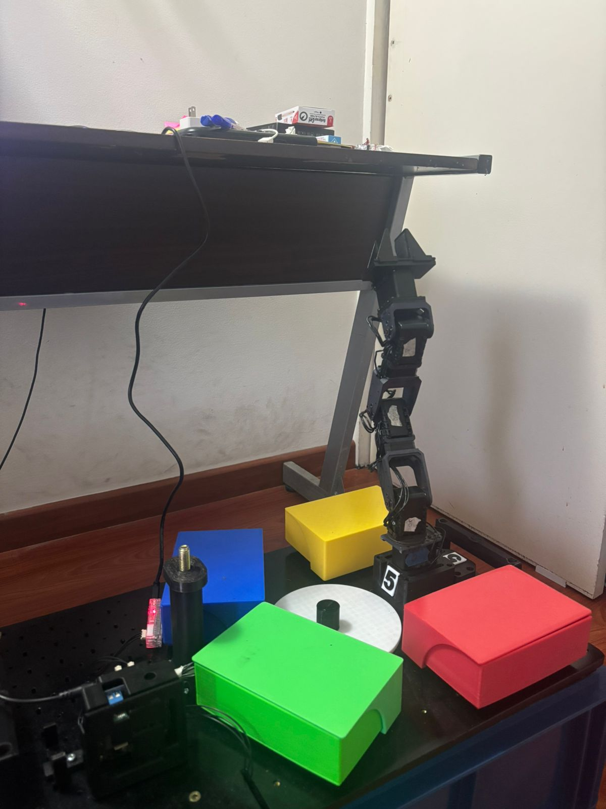

## Diagrama de flujo de acciones del robot

```md
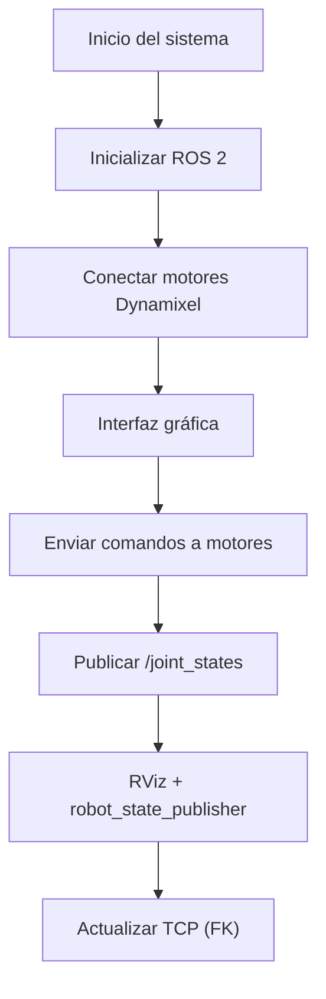

## Videos 
A continuación el video donde se demuestra el brazo alcanzando cada posición solicitada y la demostración de uso de la interfaz de usuario.

- [Video – Ejecución de poses del robot y demostración de la interfaz gráfica](videos/demostraciones.mp4)

## Plano de planta
## Código
Esta sección describe el código desarrollado para el laboratorio, el cual permite el control del manipulador Phantom X Pincher, el cálculo de la cinemática directa y la visualización del estado del robot mediante RViz y una interfaz gráfica.

El archivo que contiene el código completo del sistema es:

```text
src/pincher_controller_gui.txt
```
1. Importación de librerías
```
import rclpy
from rclpy.node import Node
from dynamixel_sdk import PortHandler, PacketHandler
import tkinter as tk
from tkinter import ttk, messagebox
import threading
import subprocess
import math
import numpy as np
```
Estas librerías permiten la creación del nodo ROS 2, la comunicación con los motores Dynamixel, la construcción de la interfaz gráfica de usuario, la ejecución de RViz y la realización de los cálculos matemáticos necesarios para la cinemática directa.

2. Selección del tipo de motor Dynamixel
```
USE_XL430 = False
```
Esta variable define el modelo de motor Dynamixel utilizado. Dependiendo de su valor, el código adapta automáticamente el protocolo de comunicación, las direcciones de memoria y los rangos de operación.

3. Funciones auxiliares de comunicación

```
def write_goal_position(packet, port, dxl_id, position):
def write_moving_speed(packet, port, dxl_id, speed):
def read_present_position(packet, port, dxl_id):
```
Estas funciones encapsulan la lectura y escritura de registros en los motores Dynamixel. Su objetivo es abstraer las diferencias entre protocolos y simplificar el envío de comandos a los actuadores.

4. Nodo ROS 2 – PincherController
```
class PincherController(Node):
```
Esta clase define el nodo principal del sistema. Se encarga de inicializar la comunicación serial con los motores, configurar los parámetros operativos, publicar los estados articulares, calcular la cinemática directa y gestionar la parada de emergencia.

5. Parámetros ROS configurables
```
self.declare_parameter('port', '/dev/ttyUSB0')
self.declare_parameter('baudrate', 1000000)
self.declare_parameter('dxl_ids', [1, 2, 3, 4, 5])
```
Estos parámetros permiten modificar la configuración del sistema sin necesidad de alterar el código fuente, utilizando el sistema de parámetros de ROS 2.

6. Publicación de estados articulares
```
self.joint_state_pub = self.create_publisher(
    JointState, '/joint_states', 10)
```
El nodo publica periódicamente el estado de las articulaciones en el tópico /joint_states, lo que permite sincronizar el robot físico con su modelo virtual en RViz.

7. Conversión entre valores Dynamixel y radianes
```
def dxl_to_radians(self, dxl_value):
def radians_to_dxl(self, radians):
```
Estas funciones convierten los valores de posición de los motores Dynamixel a radianes y viceversa, facilitando los cálculos cinemáticos y la correcta visualización del estado del robot.

8. Cálculo de la cinemática directa
```
def dh_transform(self, a, alpha, d, theta):
```
Esta función calcula la matriz de transformación homogénea utilizando los parámetros Denavit–Hartenberg para cada articulación del robot.
```
def update_tcp_position(self):
```
A partir de la matriz homogénea total se obtienen las coordenadas cartesianas X, Y y Z del TCP, las cuales se muestran en tiempo real en la interfaz gráfica.

9. Interfaz gráfica de usuario (GUI)
```
class PincherGUI:
```
La interfaz gráfica fue desarrollada utilizando Tkinter y organizada en varias pestañas que permiten el control articular, la visualización del TCP y la ejecución de RViz.

10. Integración con RViz
```
ros2 launch phantomx_pincher_description display.launch.py
```
Desde la interfaz gráfica es posible ejecutar RViz y visualizar el modelo tridimensional del manipulador sincronizado con el robot real.

11. Parada de emergencia
```
def emergency_stop(self):
```
La parada de emergencia desactiva el torque de todos los motores y bloquea el envío de nuevos comandos, garantizando la seguridad del sistema y del usuario.

*Aclaraciones importantes*

```
def r2_all_motors(self, list_q):

    # Convertir radianes a Dynmixel
        point_q = [self.radians_to_dxl(q) for q in list_q]

    # Enviar cada posición al motor correspondiente
        for index, motor_id in enumerate(self.dxl_ids):
            if motor_id == 5:      # no mover la pinza
                break

            self.move_motor(motor_id, point_q[index])

        self.get_logger().info('Todos los motores han sido movidos a las posiciones')
```

Dada una lista de posiciones (que serÍan los puntos de trabajo), estos puntos de trabajo entran en radianes, por lo que son convertidos a dxl, datos que leen los motores para poder moverse.

```
button_test2 = tk.Button(
            buttons_frame,
            text="Rutina2",
            command=lambda: self.controller.r2_all_motors([0.44,0.44,0.35,-0.35,0])
            )
        button_test2.pack(side='left', padx=20)

        button_test3 = tk.Button(
            buttons_frame,
            text="Rutina3",
            command=lambda: self.controller.r2_all_motors([-0.61,0.61,-0.52,0.52,0])
            )
        button_test3.pack(side='left', padx=20)

        button_test4 = tk.Button(
            buttons_frame,
            text="Rutina4",
            command=lambda: self.controller.r2_all_motors([1.48,0.35,0.96,0.44,0])
            )
        button_test4.pack(side='left', padx=20)

        button_test5 = tk.Button(
            buttons_frame,
            text="Rutina5",
            command=lambda: self.controller.r2_all_motors([1.40,-0.61,0.96,-0.78,0])
            )
        button_test5.pack(side='left', padx=20)
```
Aquí se observan los diferentes botones que al darles click se genera la rutina.

