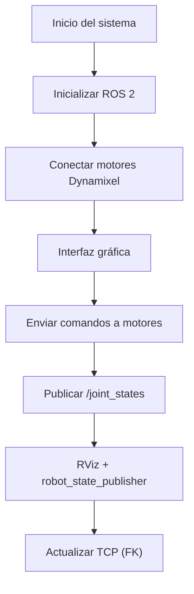
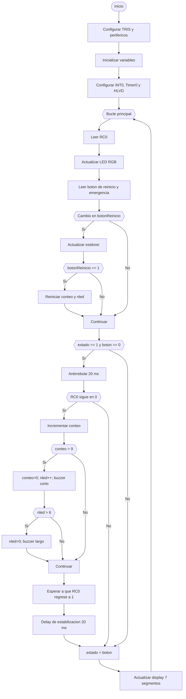
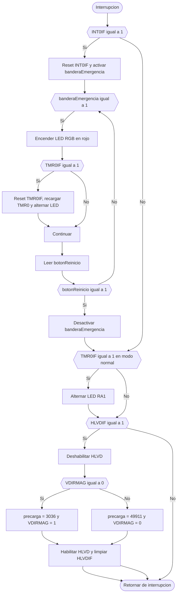

# Lab-05-Robotica-2025-2
Laboratorio 5 de Robótica 2025-2s, realizado por Jeison Diaz y Mateo Ramos

# Integrantes
1. Jeison Nicolás Diaz Arciniegas [jediazar@unal.co](JeisonD0819)
2. Mateo Ramos Cujer [mramoscu@unal.edu.co](MateoKGR)

# Informe

Indice:
1. [Descripción detallada de la solución planteada](#descripcion)
2. [Diagrama de flujo de acciones del robot](#diagrama)
3. [Plano de planta](#plano_planta)
4. [Descripción de las funciones utilizadas](#funciones)
5. [Gráfica digital](#grafica)


## Descripción detallada de la solución planteada
Se desarrolló un nodo de ROS 2 en Python que permite:

Comunicación directa con los motores Dynamixel mediante puerto serial.
Control individual y conjunto de cada articulación del manipulador.
Publicación del mensaje `/joint_states` para animación del modelo en RViz.
Implementación de una interfaz gráfica con control articular, control numérico, visualización en RViz y cálculo de la posición del TCP mediante cinemática directa.

La arquitectura del sistema integra tres componentes principales:
1. Nodo ROS 2 de control de motores.
2. Interfaz gráfica (GUI) en Tkinter.
3. Modelo del robot visualizado en RViz.

Control articular por sliders: Permite mover cada articulación del robot en tiempo real mediante deslizadores, respetando los límites físicos de los motores.
Control articular por ingreso numérico: Permite ingresar directamente valores de posición para cada motor.
Visualización en RViz: Se sincroniza el robot físico con el modelo virtual del PhantomX Pincher X100 usando `robot_state_publisher`.
Cinemática directa (TCP): Se calcula la posición del TCP utilizando parámetros DH y se muestran las coordenadas X, Y y Z en tiempo real.
Rutinas predefinidas: Se implementaron rutinas de movimiento que reproducen las poses solicitadas en el laboratorio.
## Diagramas digitales y DH utilizado
La cinemática directa se implementó usando parámetros Denavit-Hartenberg medidos directamente del robot:

| i | θᵢ | dᵢ | aᵢ | αᵢ |
|---|----|----|----|----|
| 1 | q1 | L1 | 0  | -π/2 |
| 2 | q2 | 0  | L2 | 0 |
| 3 | q3 | 0  | L3 | 0 |
| 4 | q4 | 0  | 0  | π/2 |

A continuación los diagramas utilizados.


Visualización completa en MATLAB


A continuación los diagramas digitales de las diferentes poses.


## Diagrama de flujo de acciones del robot

```md


## Plano de planta
## Descripción de las funciones utilizadas


## Grafica 2

