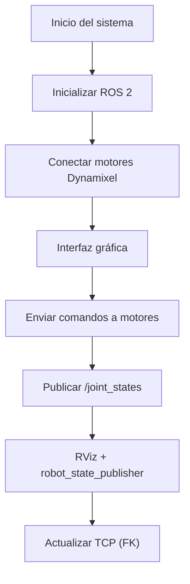

# Lab-05-Robotica-2025-2
Laboratorio 5 de Robótica 2025-2s, realizado por Jeison Diaz y Mateo Ramos

# Integrantes
1. Jeison Nicolás Diaz Arciniegas [jediazar@unal.co](JeisonD0819)
2. Mateo Ramos Cujer [mramoscu@unal.edu.co](MateoKGR)

# Informe

Indice:
1. [Descripción detallada de la solución planteada](#descripcion)
2. [Diagramas digitales y DH utilizado](#diagramas)
3. [Plano de planta](#plano_planta)
4. [Descripción de las funciones utilizadas](#funciones)
5. [Gráfica digital](#grafica)


## Descripción detallada de la solución planteada
Se desarrolló un nodo de ROS 2 en Python que permite:

Comunicación directa con los motores Dynamixel mediante puerto serial.
Control individual y conjunto de cada articulación del manipulador.
Publicación del mensaje `/joint_states` para animación del modelo en RViz.
Implementación de una interfaz gráfica con control articular, control numérico, visualización en RViz y cálculo de la posición del TCP mediante cinemática directa.

La arquitectura del sistema integra tres componentes principales:
1. Nodo ROS 2 de control de motores.
2. Interfaz gráfica (GUI) en Tkinter.
3. Modelo del robot visualizado en RViz.

*Funciones utilizadas*
Control articular por sliders: Permite mover cada articulación del robot en tiempo real mediante deslizadores, respetando los límites físicos de los motores.
Control articular por ingreso numérico: Permite ingresar directamente valores de posición para cada motor.
Visualización en RViz: Se sincroniza el robot físico con el modelo virtual del PhantomX Pincher X100 usando `robot_state_publisher`.
Cinemática directa (TCP): Se calcula la posición del TCP utilizando parámetros DH y se muestran las coordenadas X, Y y Z en tiempo real.
Rutinas predefinidas: Se implementaron rutinas de movimiento que reproducen las poses solicitadas en el laboratorio.

## Diagramas digitales y DH utilizado
La cinemática directa se implementó usando parámetros Denavit-Hartenberg medidos directamente del robot:

| i | θᵢ | dᵢ | aᵢ | αᵢ |
|---|----|----|----|----|
| 1 | q1 | L1 | 0  | -π/2 |
| 2 | q2 | 0  | L2 | 0 |
| 3 | q3 | 0  | L3 | 0 |
| 4 | q4 | 0  | 0  | π/2 |

A continuación los diagramas utilizados.


Visualización completa en MATLAB


A continuación los diagramas digitales de las diferentes poses.


## Diagrama de flujo de acciones del robot

```md


## Videos 
A continuación el video donde se demuestra el brazo alcanzando cada posición solicitada y la demostración de uso de la interfaz de usuario.

- [Video – Ejecución de poses del robot y demostración de la interfaz gráfica](videos/demostraciones.mp4)

## Plano de planta

El desarrollo del laboratorio se implementó en un único script en Python que integra el control de motores Dynamixel, comunicación mediante ROS 2, visualización en RViz, cálculo de la cinemática directa y una interfaz gráfica de usuario (GUI).  
El archivo completo se encuentra en:

```text
src/pincher_controller_gui.py
A continuación se explica el funcionamiento del código por secciones.

1. Importación de librerías
python
Copiar código
import rclpy
from rclpy.node import Node
from dynamixel_sdk import PortHandler, PacketHandler
import tkinter as tk
from tkinter import ttk, messagebox
import threading
import subprocess
import math
import numpy as np
Estas librerías permiten crear nodos ROS 2, comunicarse con los motores Dynamixel, construir la interfaz gráfica, ejecutar RViz como proceso externo y realizar los cálculos matemáticos necesarios para la cinemática directa.

2. Configuración del tipo de motor Dynamixel
python
Copiar código
USE_XL430 = False
El código está preparado para trabajar tanto con motores Dynamixel AX-12 como XL430.
Dependiendo del valor de esta variable, se configuran automáticamente:

Versión del protocolo

Direcciones de registros

Rango de posiciones y velocidades

Esto hace que el código sea reutilizable y adaptable a otros modelos de motor.

3. Funciones auxiliares de comunicación
python
Copiar código
def write_goal_position(packet, port, dxl_id, position):
def write_moving_speed(packet, port, dxl_id, speed):
def read_present_position(packet, port, dxl_id):
Estas funciones abstraen la escritura y lectura de registros Dynamixel, manejando la diferencia entre protocolos 1.0 y 2.0.
Gracias a esto, el resto del código no depende del tipo específico de motor utilizado.

4. Nodo ROS 2 – PincherController
python
Copiar código
class PincherController(Node):
Este nodo es el núcleo del sistema. Sus funciones principales son:

Inicializar la comunicación serial con los motores

Configurar velocidad, torque y posición

Publicar los estados articulares

Calcular la cinemática directa

Gestionar la parada de emergencia

Parámetros ROS configurables
python
Copiar código
self.declare_parameter('port', '/dev/ttyUSB0')
self.declare_parameter('baudrate', 1000000)
self.declare_parameter('dxl_ids', [1, 2, 3, 4, 5])
Estos parámetros permiten modificar la configuración del sistema sin cambiar el código fuente, usando directamente el servidor de parámetros de ROS 2.

5. Publicación de estados articulares (/joint_states)
python
Copiar código
self.joint_state_pub = self.create_publisher(
    JointState, '/joint_states', 10)
El nodo publica periódicamente el estado de las articulaciones en el tópico /joint_states.
Esto permite que el modelo del robot en RViz reproduzca en tiempo real los movimientos del manipulador físico.

6. Conversión Dynamixel ↔ Radianes
python
Copiar código
def dxl_to_radians(self, dxl_value):
def radians_to_dxl(self, radians):
Estas funciones convierten:

Valores de posición del motor (bits)

Ángulos en radianes

La conversión afecta únicamente la visualización y los cálculos cinemáticos, sin alterar los comandos reales enviados a los motores.

7. Cinemática directa mediante parámetros DH
La cinemática directa se implementa utilizando parámetros Denavit–Hartenberg.

python
Copiar código
def dh_transform(self, a, alpha, d, theta):
Posteriormente, se calcula la matriz homogénea total:

python
Copiar código
def update_tcp_position(self):
La transformación final se obtiene como:

ini
T = T1 · T2 · T3 · T4
A partir de esta matriz se extraen las coordenadas X, Y y Z del TCP, las cuales son mostradas en tiempo real en la interfaz gráfica.

8. Interfaz gráfica de usuario (GUI)
class PincherGUI:
La interfaz gráfica fue desarrollada en Tkinter y organizada en varias pestañas, cumpliendo con los requerimientos del laboratorio:

Control articular mediante sliders

Control articular por ingreso numérico

Visualización del robot en RViz

Visualización numérica del TCP mediante cinemática directa

9. Integración con RViz
ros2 launch phantomx_pincher_description display.launch.py
Desde la GUI es posible lanzar y detener RViz, permitiendo visualizar el modelo 3D del robot sincronizado con el manipulador real, gracias a la publicación de /joint_states.

10. Parada de emergencia
def emergency_stop(self):
La parada de emergencia desactiva el torque de todos los motores y bloquea cualquier comando nuevo hasta que el sistema sea reactivado manualmente, garantizando la seguridad del usuario y del robot.

Resumen
El código desarrollado integra control articular, cinemática directa, visualización en RViz y una interfaz gráfica completa en un solo sistema funcional.
La implementación cumple con todos los objetivos y requisitos establecidos en el Laboratorio No. 05 de Robótica.